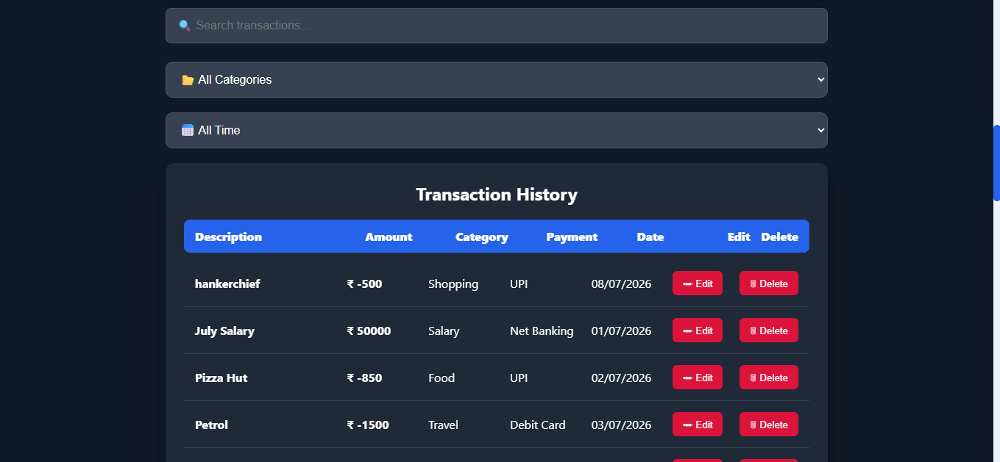
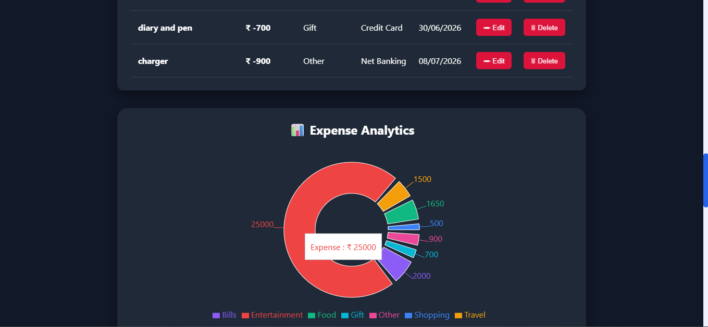
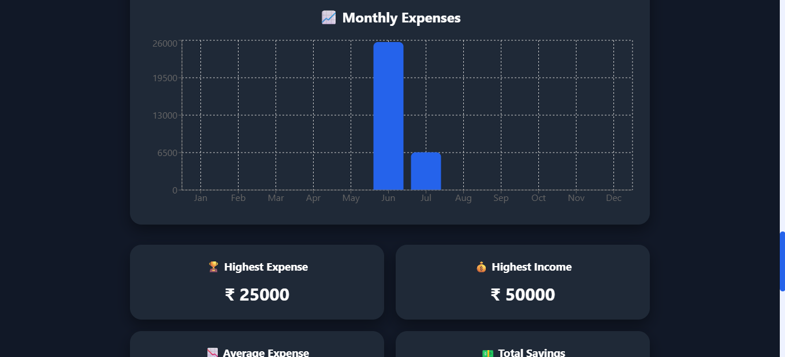

# 💰 Expense Tracker

A modern and responsive Expense Tracker built using React.

## 🚀 Live Demo

https://expense-tracker-alpha-rosy-59.vercel.app/

## 📸 Project Screenshots

### 🏠 Home Page



### 🥧 Expense Analytics



### 📈 Monthly Expense Chart



### 📊 Statistics


### 📤 Export CSV & Recent Activity


## 📂 GitHub Repository

https://github.com/Nivedita-18/expense-tracker

## ✨ Features

- ➕ Add, Edit & Delete Transactions
- 🔍 Search Transactions
- 📂 Category Filter
- 📅 Date Filter
- 📊 Pie Chart Analytics
- 📈 Monthly Expense Bar Chart
- 🌙 Dark Mode
- 📤 CSV Export
- 📱 Responsive Design
- 💾 Local Storage

## 🛠 Tech Stack

- React
- JavaScript
- CSS
- Vite
- Recharts
- React Toastify

## ⚙️ Installation

```bash
git clone https://github.com/Nivedita-18/expense-tracker.git

cd expense-tracker

npm install

npm run dev
```

## 👩‍💻 Developer

**Nivedita**
